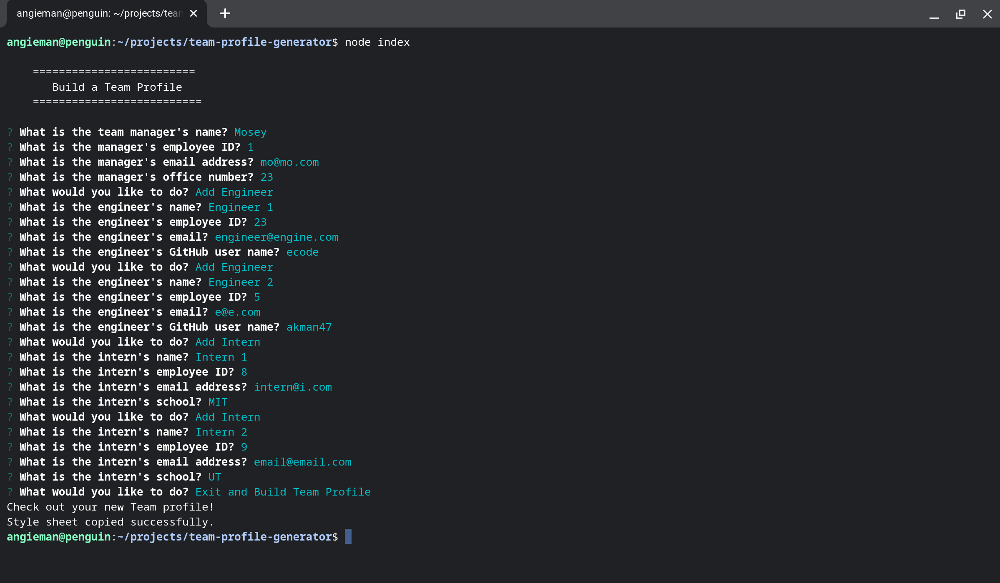
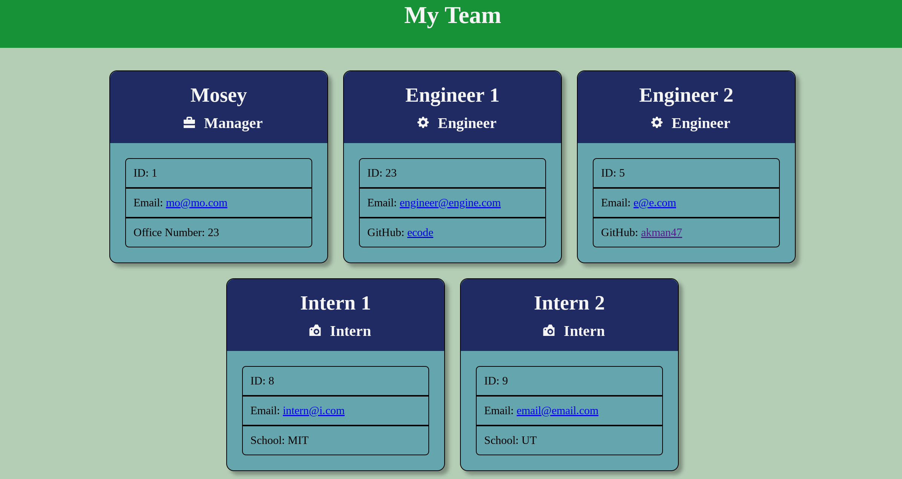

# Team Profile Generator

## Description
A command line application that takes in information about employees on a software engineering team and generates an HTML webpage displaying summaries about each person

## User Story
Aa a manager, I want to generate a webpage that displays my team's basic info so that I have quick access to their emails and GitHub profiles

## Made with
* HTML
* CSS
* JavaScript
* Node.js

## Snapshot

## Screen Recording

* [Walkthrough Link](https://drive.google.com/file/d/1K0YD6v-b3VhPqEVABp4NByzhi3y9csDD/view)

## Usage
1. Clone team profile generator repository
2. Run <code>npm install</code> to install dependencies
3. Run <code>node index</code> to run the app
4. Answer prompts and view the new team profile webpage

## Packages
* Inquirer
* Jest

## Tests
* Used Jest to test Manager, Engineer, and Intern objects, properties, and methods
* Run <code>npm test Manager</code> to test Manager objects
* Run <code>npm test Engineer</code> to test Engineer objects
* Run <code>npm test Intern</code> to test Intern objects
* Run <code>npm test</code> to test all objects

## Criteria
* GIVEN a command-line application that accepts user input
* WHEN I am prompted for my team members and their information
THEN an HTML file is generated that displays a nicely formatted team roster based on user input
* WHEN I click on an email address in the HTML
THEN my default email program opens and populates the TO field of the email with the address
* WHEN I click on the GitHub username
THEN that GitHub profile opens in a new tab
* WHEN I start the application
THEN I am prompted to enter the team manager’s name, employee ID, email address, and office number
* WHEN I enter the team manager’s name, employee ID, email address, and office number
THEN I am presented with a menu with the option to add an engineer or an intern or to finish building my team
* WHEN I select the engineer option
THEN I am prompted to enter the engineer’s name, ID, email, and GitHub username, and I am taken back to the menu
* WHEN I select the intern option
THEN I am prompted to enter the intern’s name, ID, email, and school, and I am taken back to the menu
* WHEN I decide to finish building my team
THEN I exit the application, and the HTML is generated

## Contribution
Made by Angela Man